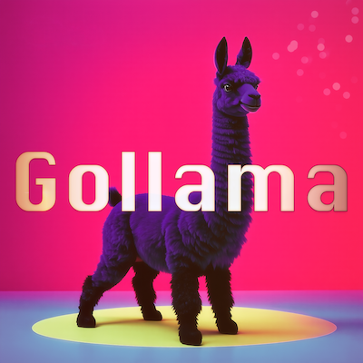
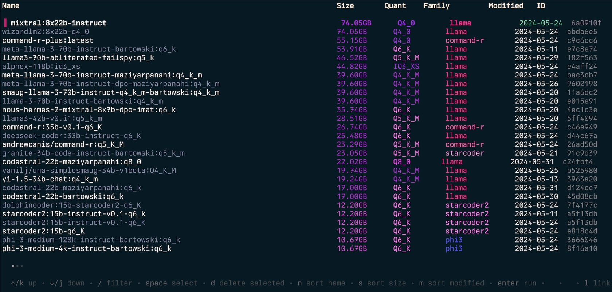
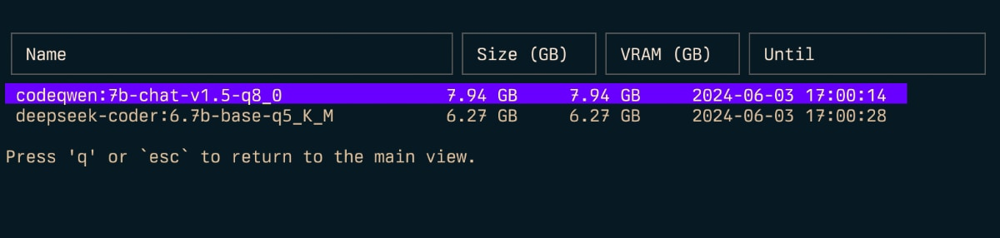
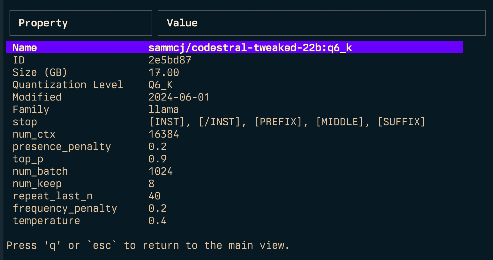
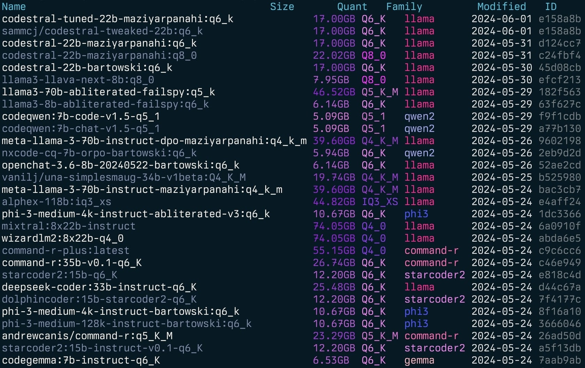
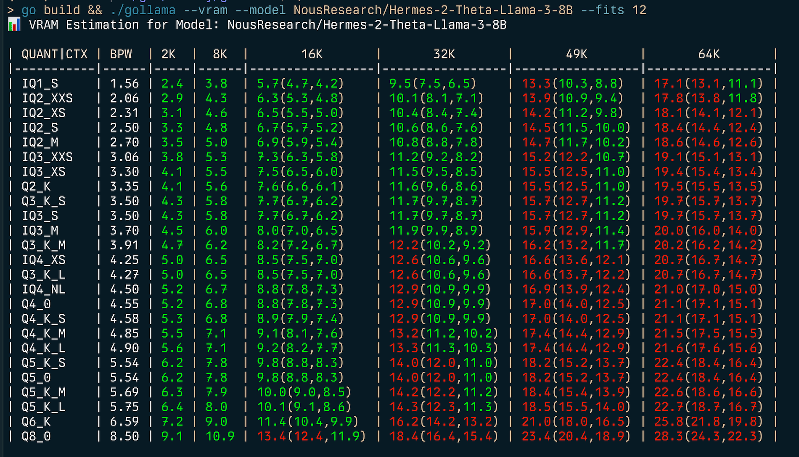

# Gollama



Gollama is a macOS / Linux tool for managing Ollama models.

It provides a TUI (Text User Interface) for listing, inspecting, deleting, copying, and pushing Ollama models as well as optionally linking them to LM Studio*.

The application allows users to interactively select models, sort, filter, edit, run, unload and perform actions on them using hotkeys.



## Table of Contents

- [Gollama](#gollama)
  - [Table of Contents](#table-of-contents)
  - [Features](#features)
  - [Installation](#installation)
    - [go install (recommended)](#go-install-recommended)
    - [curl](#curl)
    - [Manually](#manually)
    - [if "command not found: gollama"](#if-command-not-found-gollama)
  - [Usage](#usage)
    - [Key Bindings](#key-bindings)
      - [Top](#top)
      - [Inspect](#inspect)
      - [Link](#link)
      - [Spit (Copy to Remote)](#spit-copy-to-remote)
      - [Command-line Options](#command-line-options)
  - [Configuration](#configuration)
  - [Installation and build from source](#installation-and-build-from-source)
    - [Themes](#themes)
  - [Logging](#logging)
  - [Contributing](#contributing)
  - [Acknowledgements](#acknowledgements)
  - [License](#license)

## Features

The project started off as a rewrite of my [llamalink](https://smcleod.net/2024/03/llamalink-ollama-to-lm-studio-llm-model-linker/) project, but I decided to expand it to include more features and make it more user-friendly.

It's in active development, so there are some bugs and missing features, however I'm finding it useful for managing my models every day, especially for cleaning up old models.

- List available models
- Display metadata such as size, quantisation level, model family, and modified date
- Edit / update a model's Modelfile
- Sort models by name, size, modification date, quantisation level, family etc
- Select and delete models
- Run and unload models
- Inspect model for additional details
- Calculate approximate vRAM usage for a model
- Link models to LM Studio
- Copy / rename models
- Push models to a registry
- Copy models to remote hosts (spit)
- Show running models
- Has some cool bugs

See also - [ingest](https://github.com/sammcj/ingest) for passing directories/repos of code to markdown formatted for LLMs.

Gollama Intro ("Podcast" Episode):

<audio src="https://github.com/sammcj/smcleod_files/raw/refs/heads/master/audio/podcast-ep-sw/Podcast%20Episode%20-%20Gollama.mp3" controls preload></audio>

## Installation

### go install (recommended)

```shell
go install github.com/sammcj/gollama@HEAD
```

### curl

I don't recommend this method as it's not as easy to update, but you can use the following command:

```shell
curl -sL https://raw.githubusercontent.com/sammcj/gollama/refs/heads/main/scripts/install.sh | bash
```

### Manually

Download the most recent release from the [releases page](https://github.com/sammcj/gollama/releases) and extract the binary to a directory in your PATH.

e.g. `zip -d gollama*.zip -d gollama && mv gollama /usr/local/bin`

### if "command not found: gollama"

If you see this error, add environment variables to `.zshrc` or `.bashrc`.

```shell
echo 'export PATH=$PATH:$HOME/go/bin' >> ~/.zshrc
source ~/.zshrc
```

## Usage

To run the `gollama` application, use the following command:

```sh
gollama
```

_Tip_: I like to alias gollama to `g` for quick access:

```shell
echo "alias g=gollama" >> ~/.zshrc
```

### Key Bindings

- `Space`: Select
- `Enter`: Run model (Ollama run)
- `i`: Inspect model
- `t`: Top (show running models)
- `D`: Delete model
- `e`: Edit model
- `c`: Copy model
- `U`: Unload all models
- `p`: Pull an existing model
- `ctrl+k`: Pull model & preserve user configuration
- `ctrl+p`: Pull (get) new model
- `P`: Push model
- `n`: Sort by name
- `s`: Sort by size
- `m`: Sort by modified
- `k`: Sort by quantisation
- `f`: Sort by family
- `B`: Sort by parameter size
- `l`: Link model to LM Studio
- `L`: Link all models to LM Studio
- `r`: Rename model _**(Work in progress)**_
- `q`: Quit

#### Top

Top (`t`)



#### Inspect

Inspect (`i`)



#### Link

Link (`l`), Link All (`L`) and Link in the reverse direction: (`link-lmstudio`)

When linking models to LM Studio, Gollama creates a Modelfile with the template from LM-Studio and a set of default parameters that you can adjust.

Note: Linking requires admin privileges if you're running Windows.

#### Spit (Copy to Remote)

The spit functionality allows you to copy Ollama models to remote hosts. This is useful for distributing models across multiple machines or creating backups.

You can use the command-line interface:

```shell
# Copy a specific model to a remote host
gollama --spit my-model --remote http://remote-host:11434

# Copy all models to a remote host
gollama --spit-all --remote http://remote-host:11434
```

This functionality uses the [spitter](https://github.com/sammcj/spitter) package to handle the model copying process.

#### Command-line Options

- `-l`: List all available Ollama models and exit
- `-L`: Link all available Ollama models to LM Studio and exit
- `-link-lmstudio`: Link all available LM Studio models to Ollama and exit
- `--dry-run`: Show what would be linked without making any changes (use with -link-lmstudio or -L)
- `-s <search term>`: Search for models by name
  - OR operator (`'term1|term2'`) returns models that match either term
  - AND operator (`'term1&term2'`) returns models that match both terms
- `-e <model>`: Edit the Modelfile for a model
- `-ollama-dir`: Custom Ollama models directory
- `-lm-dir`: Custom LM Studio models directory
- `-cleanup`: Remove all symlinked models and empty directories and exit
- `-no-cleanup`: Don't cleanup broken symlinks
- `-u`: Unload all running models
- `-v`: Print the version and exit
- `-h`, or `--host`: Specify the host for the Ollama API
- `-H`: Shortcut for `-h http://localhost:11434` (connect to local Ollama API)
- `--spit <model>`: Copy a model to a remote host
- `--spit-all`: Copy all models to a remote host
- `--remote <url>`: Remote host URL for spit operations (e.g., http://remote-host:11434)
- `--vram`: Estimate vRAM usage for a model. Accepts:
  - Ollama models (e.g. `llama3.1:8b-instruct-q6_K`, `qwen2:14b-q4_0`)
  - HuggingFace models (e.g. `NousResearch/Hermes-2-Theta-Llama-3-8B`)
  - `--fits`: Available memory in GB for context calculation (e.g. `6` for 6GB)
  - `--vram-to-nth` or `--context`: Maximum context length to analyze (e.g. `32k` or `128k`)
  - `--quant`: Override quantisation level (e.g. `Q4_0`, `Q5_K_M`)

##### Simple model listing

Gollama can also be called with `-l` to list models without the TUI.

```shell
gollama -l
```

List (`gollama -l`):



##### Edit

Gollama can be called with `-e` to edit the Modelfile for a model.

```shell
gollama -e my-model
```

##### Search

Gollama can be called with `-s` to search for models by name.

```shell
gollama -s my-model # returns models that contain 'my-model'

gollama -s 'my-model|my-other-model' # returns models that contain either 'my-model' or 'my-other-model'

gollama -s 'my-model&instruct' # returns models that contain both 'my-model' and 'instruct'
```

##### vRAM Estimation

Gollama includes a comprehensive vRAM estimation feature:

- Calculate vRAM usage for a pulled Ollama model (e.g. `my-model:mytag`), or huggingface model ID (e.g. `author/name`)
- Determine maximum context length for a given vRAM constraint
- Find the best quantisation setting for a given vRAM and context constraint
- Shows estimates for different k/v cache quantisation options (fp16, q8_0, q4_0)
- Automatic detection of available CUDA vRAM (**coming soon!**) or system RAM



To estimate (v)RAM usage:

```shell
gollama --vram llama3.1:8b-instruct-q6_K

📊 VRAM Estimation for Model: llama3.1:8b-instruct-q6_K

| QUANT   | CTX  | BPW | 2K  | 8K              | 16K             | 32K             | 49K             | 64K |
| ------- | ---- | --- | --- | --------------- | --------------- | --------------- | --------------- |
| IQ1_S   | 1.56 | 2.2 | 2.8 | 3.7(3.7,3.7)    | 5.5(5.5,5.5)    | 7.3(7.3,7.3)    | 9.1(9.1,9.1)    |
| IQ2_XXS | 2.06 | 2.6 | 3.3 | 4.3(4.3,4.3)    | 6.1(6.1,6.1)    | 7.9(7.9,7.9)    | 9.8(9.8,9.8)    |
| IQ2_XS  | 2.31 | 2.9 | 3.6 | 4.5(4.5,4.5)    | 6.4(6.4,6.4)    | 8.2(8.2,8.2)    | 10.1(10.1,10.1) |
| IQ2_S   | 2.50 | 3.1 | 3.8 | 4.7(4.7,4.7)    | 6.6(6.6,6.6)    | 8.5(8.5,8.5)    | 10.4(10.4,10.4) |
| IQ2_M   | 2.70 | 3.2 | 4.0 | 4.9(4.9,4.9)    | 6.8(6.8,6.8)    | 8.7(8.7,8.7)    | 10.6(10.6,10.6) |
| IQ3_XXS | 3.06 | 3.6 | 4.3 | 5.3(5.3,5.3)    | 7.2(7.2,7.2)    | 9.2(9.2,9.2)    | 11.1(11.1,11.1) |
| IQ3_XS  | 3.30 | 3.8 | 4.5 | 5.5(5.5,5.5)    | 7.5(7.5,7.5)    | 9.5(9.5,9.5)    | 11.4(11.4,11.4) |
| Q2_K    | 3.35 | 3.9 | 4.6 | 5.6(5.6,5.6)    | 7.6(7.6,7.6)    | 9.5(9.5,9.5)    | 11.5(11.5,11.5) |
| Q3_K_S  | 3.50 | 4.0 | 4.8 | 5.7(5.7,5.7)    | 7.7(7.7,7.7)    | 9.7(9.7,9.7)    | 11.7(11.7,11.7) |
| IQ3_S   | 3.50 | 4.0 | 4.8 | 5.7(5.7,5.7)    | 7.7(7.7,7.7)    | 9.7(9.7,9.7)    | 11.7(11.7,11.7) |
| IQ3_M   | 3.70 | 4.2 | 5.0 | 6.0(6.0,6.0)    | 8.0(8.0,8.0)    | 9.9(9.9,9.9)    | 12.0(12.0,12.0) |
| Q3_K_M  | 3.91 | 4.4 | 5.2 | 6.2(6.2,6.2)    | 8.2(8.2,8.2)    | 10.2(10.2,10.2) | 12.2(12.2,12.2) |
| IQ4_XS  | 4.25 | 4.7 | 5.5 | 6.5(6.5,6.5)    | 8.6(8.6,8.6)    | 10.6(10.6,10.6) | 12.7(12.7,12.7) |
| Q3_K_L  | 4.27 | 4.7 | 5.5 | 6.5(6.5,6.5)    | 8.6(8.6,8.6)    | 10.7(10.7,10.7) | 12.7(12.7,12.7) |
| IQ4_NL  | 4.50 | 5.0 | 5.7 | 6.8(6.8,6.8)    | 8.9(8.9,8.9)    | 10.9(10.9,10.9) | 13.0(13.0,13.0) |
| Q4_0    | 4.55 | 5.0 | 5.8 | 6.8(6.8,6.8)    | 8.9(8.9,8.9)    | 11.0(11.0,11.0) | 13.1(13.1,13.1) |
| Q4_K_S  | 4.58 | 5.0 | 5.8 | 6.9(6.9,6.9)    | 8.9(8.9,8.9)    | 11.0(11.0,11.0) | 13.1(13.1,13.1) |
| Q4_K_M  | 4.85 | 5.3 | 6.1 | 7.1(7.1,7.1)    | 9.2(9.2,9.2)    | 11.4(11.4,11.4) | 13.5(13.5,13.5) |
| Q4_K_L  | 4.90 | 5.3 | 6.1 | 7.2(7.2,7.2)    | 9.3(9.3,9.3)    | 11.4(11.4,11.4) | 13.6(13.6,13.6) |
| Q5_K_S  | 5.54 | 5.9 | 6.8 | 7.8(7.8,7.8)    | 10.0(10.0,10.0) | 12.2(12.2,12.2) | 14.4(14.4,14.4) |
| Q5_0    | 5.54 | 5.9 | 6.8 | 7.8(7.8,7.8)    | 10.0(10.0,10.0) | 12.2(12.2,12.2) | 14.4(14.4,14.4) |
| Q5_K_M  | 5.69 | 6.1 | 6.9 | 8.0(8.0,8.0)    | 10.2(10.2,10.2) | 12.4(12.4,12.4) | 14.6(14.6,14.6) |
| Q5_K_L  | 5.75 | 6.1 | 7.0 | 8.1(8.1,8.1)    | 10.3(10.3,10.3) | 12.5(12.5,12.5) | 14.7(14.7,14.7) |
| Q6_K    | 6.59 | 7.0 | 8.0 | 9.4(9.4,9.4)    | 12.2(12.2,12.2) | 15.0(15.0,15.0) | 17.8(17.8,17.8) |
| Q8_0    | 8.50 | 8.8 | 9.9 | 11.4(11.4,11.4) | 14.4(14.4,14.4) | 17.4(17.4,17.4) | 20.3(20.3,20.3) |
```

To find the best quantisation type for a given memory constraint (e.g. 6GB) you can provide `--fits <number of GB>`:

```shell
gollama --vram NousResearch/Hermes-2-Theta-Llama-3-8B --fits 6

📊 VRAM Estimation for Model: NousResearch/Hermes-2-Theta-Llama-3-8B

| QUANT/CTX | BPW  | 2K  | 8K  | 16K          | 32K           | 49K            | 64K             |
| --------- | ---- | --- | --- | ------------ | ------------- | -------------- | --------------- |
| IQ1_S     | 1.56 | 2.4 | 3.8 | 5.7(4.7,4.2) | 9.5(7.5,6.5)  | 13.3(10.3,8.8) | 17.1(13.1,11.1) |
| IQ2_XXS   | 2.06 | 2.9 | 4.3 | 6.3(5.3,4.8) | 10.1(8.1,7.1) | 13.9(10.9,9.4) | 17.8(13.8,11.8) |
...
```

This will display a table showing vRAM usage for various quantisation types and context sizes.

The vRAM estimator works by:

1. Fetching the model configuration from Hugging Face (if not cached locally)
2. Calculating the memory requirements for model parameters, activations, and KV cache
3. Adjusting calculations based on the specified quantisation settings
4. Performing binary and linear searches to optimize for context length or quantisation settings

Note: The estimator will attempt to use CUDA vRAM if available, otherwise it will fall back to system RAM for calculations.

## Configuration

Gollama uses a JSON configuration file located at `~/.config/gollama/config.json`. The configuration file includes options for sorting, columns, API keys, log levels, theme etc...

Example configuration:

```json
{
  "default_sort": "modified",
  "columns": [
    "Name",
    "Size",
    "Quant",
    "Family",
    "Modified",
    "ID"
  ],
  "ollama_api_key": "",
  "ollama_api_url": "http://localhost:11434",
  "lm_studio_file_paths": "",
  "log_level": "info",
  "log_file_path": "/Users/username/.config/gollama/gollama.log",
  "sort_order": "Size",
  "strip_string": "my-private-registry.internal/",
  "editor": "",
  "docker_container": ""
}
```

- `strip_string` can be used to remove a prefix from model names as they are displayed in the TUI. This can be useful if you have a common prefix such as a private registry that you want to remove for display purposes.
- `docker_container` - **experimental** - if set, gollama will attempt to perform any run operations inside the specified container.
- `editor` - **experimental** - if set, gollama will use this editor to open the Modelfile for editing.
- `theme` - **experimental** The name of the theme to use (without .json extension)

## Installation and build from source

1. Clone the repository:

    ```shell
    git clone https://github.com/sammcj/gollama.git
    cd gollama
    ```

2. Build:

    ```shell
    go get
    make build
    ```

3. Run:

    ```shell
    ./gollama
    ```

### Themes

Gollama has basic customisable theme support, themes are stored as JSON files in `~/.config/gollama/themes/`.
The active theme can be set via the `theme` setting in your config file (without the .json extension).

Default themes will be created if they don't exist:

- `default` - Dark theme with neon accents (default)
- `light-neon` - Light theme with neon accents, suitable for light terminal backgrounds

To create a custom theme:

1. Create a new JSON file in the themes directory (e.g. `~/.config/gollama/themes/my-theme.json`)
2. Use the following structure:

```json
{
  "name": "my-theme",
  "description": "My custom theme",
  "colours": {
    "header_foreground": "#AA1493",
    "header_border": "#BA1B11",
    "selected": "#FFFFFF",
    ...
  },
  "family": {
    "llama": "#FF1493",
    "alpaca": "#FF00FF",
    ...
  }
}
```

Colours can be specified as ANSI colour codes (e.g. "241") or hex values (e.g. "#FF00FF"). The `family` section defines colours for different model families in the list view.

_Note: Using the VSCode extension ['Color Highlight'](https://marketplace.visualstudio.com/items?itemName=naumovs.color-highlight) makes it easier to find the hex values for colours._

## Logging

Logs can be found in the `gollama.log` which is stored in `$HOME/.config/gollama/gollama.log` by default.
The log level can be set in the configuration file.

## Contributing

Contributions are welcome!
Please fork the repository and create a pull request with your changes.

<!-- readme: contributors -start -->
<table>
	<tbody>
		<tr>
            <td align="center">
                <a href="https://github.com/sammcj">
                    
                    <br />
                    <sub><b>Sam</b></sub>
                </a>
            </td>
            <td align="center">
                <a href="https://github.com/Camsbury">
                    
                    <br />
                    <sub><b>Cameron Kingsbury</b></sub>
                </a>
            </td>
            <td align="center">
                <a href="https://github.com/KimCookieYa">
                    
                    <br />
                    <sub><b>KimCookieYa</b></sub>
                </a>
            </td>
            <td align="center">
                <a href="https://github.com/DenisBalan">
                    
                    <br />
                    <sub><b>Denis Balan</b></sub>
                </a>
            </td>
            <td align="center">
                <a href="https://github.com/erg">
                    
                    <br />
                    <sub><b>Doug Coleman</b></sub>
                </a>
            </td>
            <td align="center">
                <a href="https://github.com/Impact123">
                    
                    <br />
                    <sub><b>Impact</b></sub>
                </a>
            </td>
		</tr>
		<tr>
            <td align="center">
                <a href="https://github.com/josekasna">
                    
                    <br />
                    <sub><b>Jose Almaraz</b></sub>
                </a>
            </td>
            <td align="center">
                <a href="https://github.com/jralmaraz">
                    
                    <br />
                    <sub><b>Jose Roberto Almaraz</b></sub>
                </a>
            </td>
            <td align="center">
                <a href="https://github.com/Br1ght0ne">
                    
                    <br />
                    <sub><b>Oleksii Filonenko</b></sub>
                </a>
            </td>
            <td align="center">
                <a href="https://github.com/southwolf">
                    
                    <br />
                    <sub><b>SouthWolf</b></sub>
                </a>
            </td>
            <td align="center">
                <a href="https://github.com/anrgct">
http                    
                    <br />
                    <sub><b>anrgct</b></sub>
                </a>
            </td>
            <td align="center">
                <a href="https://github.com/fuho">
                    
                    <br />
                    <sub><b>ondrej</b></sub>
                </a>
            </td>
		</tr>
	<tbody>
</table>
<!-- readme: contributors -end -->

## Acknowledgements

- [Ollama](https://ollama.com/)
- [Llama.cpp](https://github.com/ggerganov/llama.cpp)
- [Charmbracelet](https://charm.sh/)
- [Spitter](https://github.com/sammcj/spitter) - For model copying functionality

Thank you to folks such as Matt Williams, Fahd Mirza and AI Code King for giving this a shot and providing feedback.

[](https://www.youtube.com/watch?v=T4uiTnacyhI)
[](https://www.youtube.com/watch?v=OCXuYm6LKgE)
[](https://www.youtube.com/watch?v=24yqFrQV-4Q)

## License

Copyright © 2024 Sam McLeod

This project is licensed under the MIT License. See the [LICENSE](LICENSE) file for details.
