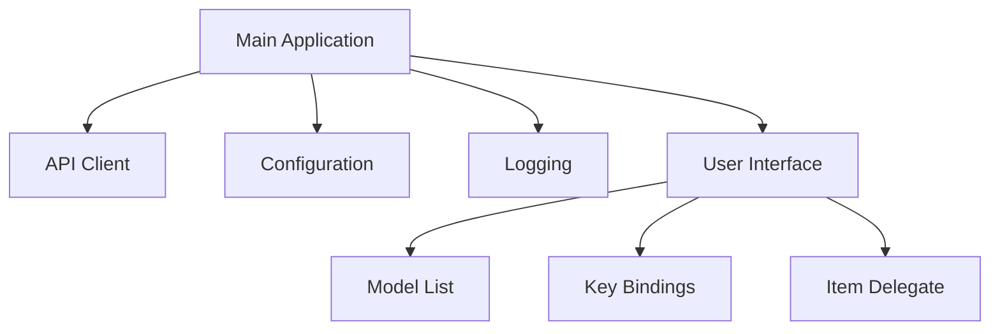
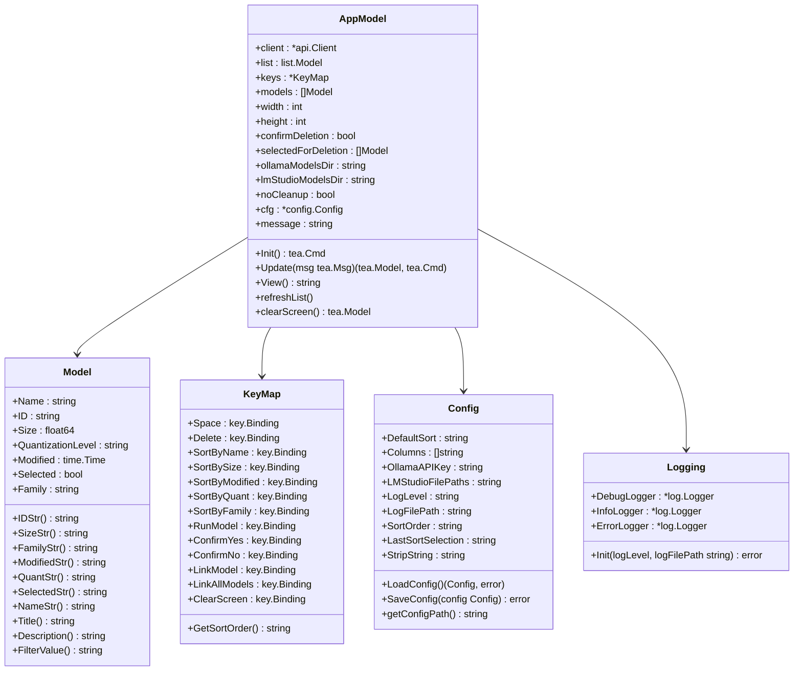

# Gollama

Gollama is a Go-based client for Ollama for managing models.
It provides a TUI for listing, sorting, selecting and deleting models and can link Ollama models to LM-Studio.

The project started off as a rewrite of my [llamalink](https://smcleod.net/2024/03/llamalink-ollama-to-lm-studio-llm-model-linker/) project, but I decided to expand it to include more features and make it more user-friendly.

## Table of Contents

- [Gollama](#gollama)
  - [Table of Contents](#table-of-contents)
  - [Features](#features)
  - [Installation](#installation)
  - [Usage](#usage)
    - [Simple model listing](#simple-model-listing)
  - [Configuration](#configuration)
  - [Logging](#logging)
  - [Contributing](#contributing)
  - [License](#license)
  - [Architecture](#architecture)
    - [Component Diagram](#component-diagram)
    - [Class Diagram](#class-diagram)

## Features

- Interactive TUI with sorting and filtering capabilities.
- List available models and display basic metadata such as size, quantization level, model family, and modified date.
- Run models.
- Select and delete models.
- Link models to LM-Studio.


## Installation

1. Clone the repository:

    ```shell
    git clone https://github.com/sammcj/gollama.git
    cd gollama
    ```

2. Build the project:

    ```shell
    make build
    ```

## Usage

1. Run the application:

    ```shell
    ./gollama
    ```

2. Use the interactive TUI to list, select, delete, and link models.

### Simple model listing

Gollama can also be called with `-l` to list models without the TUI.

```shell
./gollama -l
```


Other cli arguments can be listed with `--help`:

```shell
Loading config from: /Users/samm/.config/gollama/config.json
Usage of ./gollama:
-cleanup
    Remove all symlinked models and empty directories and exit
-l  List all available Ollama models and exit
-lm-dir string
    Custom LM Studio models directory
-no-cleanup
    Don't cleanup broken symlinks
-ollama-dir string
    Custom Ollama models directory
```

## Configuration

Gollama uses a JSON configuration file located at `~/.config/gollama/config.json`. The configuration file includes options for sorting, columns, API keys, log levels etc...

Example configuration:

```json
{
  "default_sort": "modified",
  "columns": [
    "Name",
    "Size",
    "Quant",
    "Family",
    "Modified",
    "ID"
  ],
  "ollama_api_key": "",
  "ollama_api_url": "http://localhost:14434",
  "lm_studio_file_paths": "",
  "log_level": "info",
  "log_file_path": "gollama.log",
  "sort_order": "Size",
  "strip_string": "my-private-registry.internal/"
}
```

The strip string option can be used to remove a prefix from model names as they are displayed in the TUI.
This can be useful if you have a common prefix such as a private registry that you want to remove for display purposes.

## Logging

Logs can be found in the `gollama.log` which is stored in `$HOME/.config/gollama/gollama.log` by default.
The log level can be set in the configuration file.

## Contributing

Contributions are welcome!
Please fork the repository and create a pull request with your changes.

## License

Copyright © 2024 Sam McLeod

This project is licensed under the MIT License. See the [LICENSE](LICENSE) file for details.

## Architecture

### Component Diagram



### Class Diagram


