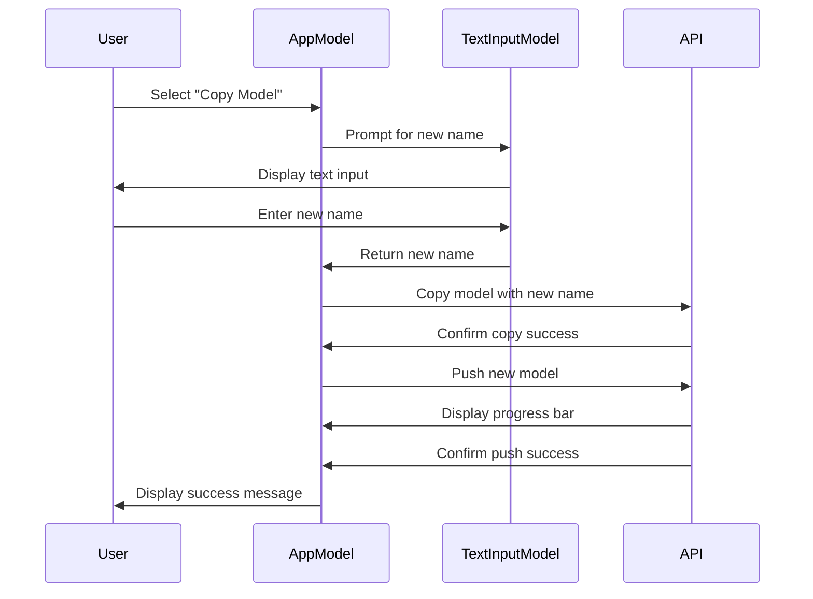
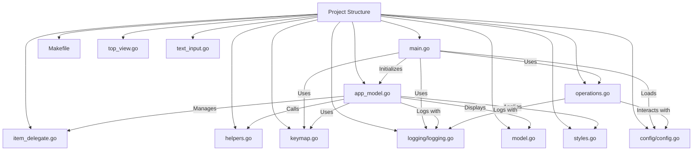

# Gollama

Gollama is a tool for managing Ollama models.

It provides a TUI (Text User Interface) for listing, inspecting, deleting, copying, and pushing Ollama models as well as optionally linking them to LM Studio.

The application allows users to interactively select models, sort them by various criteria, and perform actions on them using hotkeys.


## Table of Contents

- [Gollama](#gollama)
  - [Table of Contents](#table-of-contents)
  - [Features](#features)
  - [Installation](#installation)
  - [Usage](#usage)
    - [Key Bindings](#key-bindings)
      - [Command-line Options](#command-line-options)
  - [Configuration](#configuration)
  - [Installation and build from source](#installation-and-build-from-source)
  - [Logging](#logging)
  - [Contributing](#contributing)
  - [License](#license)
  - [Acknowledgements](#acknowledgements)
  - [Diagrams](#diagrams)
    - [Workflow](#workflow)
    - [Components](#components)

## Features

The project started off as a rewrite of my [llamalink](https://smcleod.net/2024/03/llamalink-ollama-to-lm-studio-llm-model-linker/) project, but I decided to expand it to include more features and make it more user-friendly.

It's in the early stages of development, so there are plenty of bugs and missing features, but I'm already finding it useful for managing my models, especially for cleaning up old models.

- Interactive TUI with sorting and filtering capabilities.
- List available models and display basic metadata such as size, quantization level, model family, and modified date.
- Sort models by name, size, modification date, quantization level, and family.
- Select and delete models.
- Inspect model for additional details.
- Link models to LM Studio.
- Copy models.
- Push models to a registry.
- Show running models.
- Plenty more comings soon if I continue to find the tool useful.

## Installation

From go:

```shell
go install github.com/sammcj/gollama@latest
```

From Github:

Download the most recent release from the [releases page](https://github.com/sammcj/gollama/releases) and extract the binary to a directory in your PATH.

e.g. `zip -d gollama-v1.4.2.zip -d gollama && mv gollama /usr/local/bin`

## Usage

To run the `gollama` application, use the following command:

```sh
gollama
```

### Key Bindings

- `Space`: Select
- `i`: Inspect model
- `t`: Top (show running models)
- `r`: Run model (Ollama run)
- `D`: Delete model
- `c`: Copy model
- `P`: Push model
- `n`: Sort by name
- `s`: Sort by size
- `m`: Sort by modified
- `k`: Sort by quantization
- `f`: Sort by family
- `l`: Link model to LM Studio
- `L`: Link all models to LM Studio
- `q`: Quit
- `?`: Help

#### Command-line Options

- `-l`: List all available Ollama models and exit
- `-ollama-dir`: Custom Ollama models directory
- `-lm-dir`: Custom LM Studio models directory
- `-no-cleanup`: Don't cleanup broken symlinks
- `-cleanup`: Remove all symlinked models and empty directories and exit
- `-v`: Print the version and exit

##### Simple model listing

Gollama can also be called with `-l` to list models without the TUI.

```shell
gollama -l
```


## Configuration

Gollama uses a JSON configuration file located at `~/.config/gollama/config.json`. The configuration file includes options for sorting, columns, API keys, log levels etc...

Example configuration:

```json
{
  "default_sort": "modified",
  "columns": [
    "Name",
    "Size",
    "Quant",
    "Family",
    "Modified",
    "ID"
  ],
  "ollama_api_key": "",
  "ollama_api_url": "http://localhost:11434",
  "lm_studio_file_paths": "",
  "log_level": "info",
  "log_file_path": "/Users/username/.config/gollama/gollama.log",
  "sort_order": "Size",
  "strip_string": "my-private-registry.internal/"
}
```

The strip string option can be used to remove a prefix from model names as they are displayed in the TUI.
This can be useful if you have a common prefix such as a private registry that you want to remove for display purposes.

## Installation and build from source

1. Clone the repository:

    ```shell
    git clone https://github.com/sammcj/gollama.git
    cd gollama
    ```

2. Build:

    ```shell
    go get
    make build
    ```

3. Run:

    ```shell
    ./gollama
    ```

## Logging

Logs can be found in the `gollama.log` which is stored in `$HOME/.config/gollama/gollama.log` by default.
The log level can be set in the configuration file.

## Contributing

Contributions are welcome!
Please fork the repository and create a pull request with your changes.

## License

Copyright © 2024 Sam McLeod

This project is licensed under the MIT License. See the [LICENSE](LICENSE) file for details.

## Acknowledgements

- [Ollama](https://ollama.com/) for the API and model management tools.
- [Charmbracelet](https://charm.sh/) for the Bubble Tea framework and other packages used in this application.

## Diagrams

### Workflow



### Components


